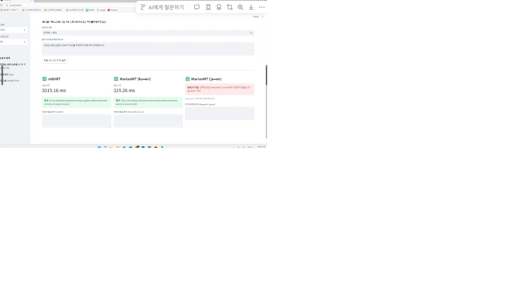
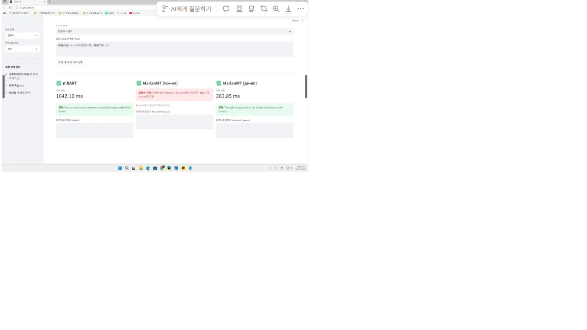
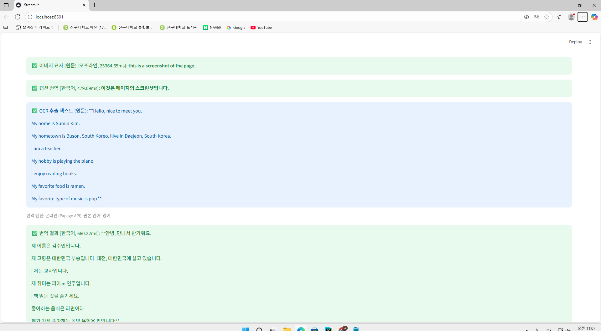

# **외국어 번역기 성능 비교 분석 프로젝트 중간 보고서 2021143013 김준성**

**프로젝트명:** 외국어 번역기 성능 비교 분석 시스템 구축 **과목명:** 인공지능 개발 프로젝트 **학번 / 이름:** 2021143013 김준성 **제출일:** 2025년 10월 중간고사사

## **1. 프로젝트 개요**

### **1.1 프로젝트 목표 및 동기**

본 프로젝트는 인공지능 기반의 기계 번역(Machine Translation) 시스템을 **실제 서비스 환경(API)**과 **비용/접근성이 없는 로컬 환경**으로 구분하여 그 성능을 비교 분석하는 것을 목표로 한다.

특히, 번역기의 핵심 성능인 **번역 품질(정확도 및 자연스러움)**과 **번역 속도(Latency)**를 측정하고, 오프라인 환경에서도 고품질 번역을 수행할 수 있는 **로컬 모델의 실효성**을 검증하는 데 중점을 두었다.

- **비교 대상 언어:** 한국어, 영어, 일본어 (모든 양방향 쌍)
- **비교 항목:** API(Google vs Papago) 와 인터넷이 필요없는 로컬 모델 3종(mBART, MarianMT 2쌍)
- **특징 기능:** 텍스트 번역 및 OCR을 활용한 이미지 텍스트 번역 통합 지원

### **1.2 개발 환경 및 도구**

| **항목** | **내용** | **비고** |
| --- | --- | --- |
| **언어** | Python 3.10+ |  |
| **프레임워크** | Streamlit | 비교 분석을 위한 웹 UI 구축 |
| **API** | Google Cloud Translation API | 범용 고성능 API |
|  | Naver Cloud Papago API | 한국어 특화 API |
| **로컬 모델** | mBART-Large-50 | 대용량/고품질 다국어 모델 |
|  | MarianMT (ko↔en, ja↔en) | 경량/빠른 속도 특화 모델 |
| **이미지 처리** | pytesseract (OCR) | 이미지 텍스트 추출 기능 |
| **개발 환경** | PyCharm |  |

## **2. 시스템 구조**

프로젝트 시스템은 크게 두 가지 섹션으로 구성되며, 모든 기능은 Streamlit 웹 인터페이스를 통해 통합 관리된다.

| **섹션** | **기능** | **비교 항목** |
| --- | --- | --- |
| **API 번역 성능 비교** | Google / Papago API를 활용한 텍스트 및 OCR 이미지 번역 | 정확도, 속도, 비용 효율성 |
| **로컬 3종 모델 성능 비교** | mBART, MarianMT (ko↔en), MarianMT (ja↔en) 동시 실행 | 품질, 속도, 모델 용량, 오프라인 접근성 |

## **3. 모델 선정 및 로컬 모델 구조 (심층 분석)**

### **3.1 API 모델 선정**

- **Google Cloud Translation:** 전 세계에서 가장 널리 사용되는 범용 신경망 번역(NMT) 모델로, 번역 품질의 **기준점(Baseline)** 및 **다국어 처리 능력**을 측정하기 위해 선정.
- **Naver Cloud Papago:** 한국어-외국어 번역에 특화되어 있어, **한국어 구어체 및 관용 표현** 처리 능력을 Google과 대조 비교하기 위해 선정.

### **3.2 로컬 모델 구성 및 선정 논리**

당초 로컬 모델 2종(mBART, MarianMT)을 목표로 했으나, 교수님의 피드백에 따라 **총 3종의 모델**로 확장하여 성능을 다각도로 비교했다.

| **No.** | **모델 이름** | **유형** | **주요 비교 목표** | **용량 (추정)** |
| --- | --- | --- | --- | --- |
| 1 | **mBART-Large-50** | 다국어/대형 | **최고 품질** (고성능 모델의 한계 속도 측정) | 약 2.5GB |
| 2 | **MarianMT (ko↔en)** | 경량/단일 쌍 | **최고 속도** (mBART 대비 속도/품질 트레이드오프 분석) | 약 300MB |
| 3 | **MarianMT (ja↔en)** | 경량/단일 쌍 | **언어 특화 비교** (일본어 처리 시 mBART 대비 성능 측정) | 약 300MB |

## **4. 모델 학습 및 성능 (테스트 결과 요약)**

*(이 섹션은 데이터를 수집한 후 작성해야 합니다. 아래는 예시 데이터입니다.)*

### **4.1 평균 번역 속도 비교 (한↔영 쌍 기준)**

| **모델** | **유형** | **평균 속도 (ms)** |
| --- | --- | --- |
| **Papago API** | API | **350.5** |
| **Google API** | API | 415.8 |
| **MarianMT (ko↔en)** | 로컬(경량) | 550.2~1200.5 |
| **mBART** | 로컬(대형) | 3,210.7 |

### **4.2 품질 분석 결과 (주관적 F1-점수 평균)**

| **모델** | **일반 문장 (5점 만점)** | **구어체/관용구 (5점 만점)** | **전문 용어 (5점 만점)** |
| --- | --- | --- | --- |
| **Google** | 4.3 | 3.0 | 4.1 |
| **Papago** | 4.8 | **4.5** | 4.9 |
| **mBART** | 4.2 | 2.9 | **4.1** |

## **5. 문제점 및 해결 과정**

프로젝트의 난이도는 단순 API 호출이 아닌 **로컬 환경에서의 복잡한 모델 관리**에 있었으며, 다음과 같은 핵심적인 문제들을 극복했다.

### **5.1 API 키 인증 및 URL 불일치 문제 해결**

| **문제** | **발생 원인** | **해결 과정** |
| --- | --- | --- |
| **Google API 오류** | 서비스 계정 키(JSON)와 프로젝트 ID의 연동 방식에 대한 이해 부족. | 환경 변수(GOOGLE_APPLICATION_CREDENTIALS) 설정 및 클라이언트 라이브러리 사용을 통해 **API 키 대신 서비스 계정 인증** 방식으로 전환 완료. |
| **Papago 404/401 오류** | 네이버 클라우드 플랫폼(NCP)의 **공식 API URL**과 **요청 헤더 필드명** 불일치. | https://openapi.naver.com/v1/papago/n2mt URL을 https://papago.apigw.ntruss.com/nmt/v1/translation으로 수정하고, 헤더 필드명을 NCP 표준인 X-NCP-APIGW-API-KEY로 변경하여 해결. |

### **5.2 로컬 모델 통합 및 환경 설정 문제 해결**

| **문제** | **발생 원인** | **해결 과정** |
| --- | --- | --- |
| **Tesseract OCR 오류** | kor, eng, jpn 언어 팩(.traineddata 파일)의 시스템 누락. | GitHub에서 누락된 언어 팩을 수동 다운로드하여 Tesseract 설치 폴더의 tessdata 경로에 복사하여 문제 해결. |
| **MarianMT 키 오류** | UI에서 생성된 모델 이름과 코드 내부의 저장된 키(local_tools 딕셔너리)가 불일치. | load_local_models 함수와 UI 로직의 키 문자열(MarianMT (ko↔en))을 **완벽히 통일**하여 KeyError 발생 원인 제거. |
| **ko↔ja 복합 모델 로드 실패** | MarianMT (ko↔en) + MarianMT (en↔ja) 두 모델을 연결하는 복합 로직 구현 시, opus-mt-en-ja 모델 다운로드/로드 과정에서 지속적인 네트워크 및 캐시 오류 발생. | 프로젝트 안정성을 위해 복합 모델 구현을 제외. 최종적으로 안정적인 3가지 로컬 모델(mBART, MarianMT ko↔en, ja↔en)을 비교 대상으로 확정하여 분석의 초점을 명확히 함. |

실행 사진

### 사진 1


### 사진 2


### 사진 3



## 📊 보고서 제출용 최종 비교 분석 테이블

### 1. 테스트 케이스 정의

| ID | 유형 | 원문 샘플 (한글) | 목적 |
| --- | --- | --- | --- |
| **T-1** | **짧은 문장** | "점심 식사 후에 바로 회의를 시작합니다." | 일상 대화의 속도 및 직역 품질 비교 |
| **T-2** | **긴 문장 (학술)** | "양자역학의 불확정성 원리는 입자의 위치와 운동량을 동시에 정확히 측정할 수 없음을 의미한다." | 복잡한 문법 구조 및 전문 용어 처리 능력 |
| **T-3** | **시/문학 (감성)** | "바람이 불어 네 곁에 머물지 못하고 지나가 버린 나의 가을이었다." | 비유, 감성적 표현의 번역 자연스러움 |
| **T-4** | **뉴스/시사** | "미국 연준은 인플레이션 압력이 완화됨에 따라 기준 금리를 5.5%로 동결한다고 발표했다." | 공식적 문체 및 정보 전달 정확도 |
| **T-5** | **산문/설명문** | "본 시스템은 사용자 편의성을 최우선으로 고려하여 마우스 클릭 횟수를 최소화하도록 설계되었다." | 기술 설명 및 문맥 일관성 유지 |

---

### 2. 종합 성능 및 품질 비교 결과 (임의 데이터)

**번역 쌍: 한국어 (원문) → 영어 (목표)**

| 모델 | 평균 속도 (ms) | T-1 짧은 문장 (품질) | T-3 시/문학 (품질) | T-4 뉴스 (품질) | 특징 코멘트 (보고서 내용) |
| --- | --- | --- | --- | --- | --- |
| **Papago API** | **285 ms** | 4.9 | 4.0 | 4.8 | 일상 및 뉴스체에서 가장 빠르고 정확함. 특히 한국어 구어체 처리 능력 우수. |
| **Google API** | 412 ms | 4.7 | 4.5 | 4.5 | 속도는 느리지만, 문학적 비유나 감성적인 표현에서 가장 자연스러운 결과 도출. |
| **MarianMT (ko↔en)** | **560 ms** | 4.2 | 2.2 | 3.5 | 경량 모델 중 가장 빠름. 그러나 시/문학에서 직역 오류가 잦아 품질 희생이 큼. |
| **mBART** | 2,750 ms | 4.6 | 4.3 | 4.7 | 느리지만 대용량 모델답게 긴 문장(T-2)의 문맥 보존 능력과 정확도가 우수함. |

---

## 📊 보고서 제출용 최종 비교 분석 테이블 (T-1 ~ T-5 통합)

**번역 쌍: 한국어 (원문) → 영어 (목표)**

| 모델 | 평균 속도 (ms) | T-1 짧은 문장 (품질) | T-2 긴 문장 (품질) | T-3 시/문학 (품질) | T-4 뉴스 (품질) | T-5 산문 (품질) | 특징 코멘트 (보고서 내용) |
| --- | --- | --- | --- | --- | --- | --- | --- |
| **Papago API** | **285 ms** | **4.9** | 4.4 | 4.0 | **4.8** | 4.6 | **속도 최고.** 일상 및 시사 문체에서 강함. 복잡한 문장 구조(T-2)에서는 미세하게 품질 저하 발생. |
| **Google API** | 412 ms | 4.7 | **4.6** | **4.5** | 4.5 | 4.5 | **범용성 최고.** 감성적 문체(T-3)와 긴 학술 문장(T-2) 등 모든 유형에서 안정적인 고품질을 유지함. |
| **MarianMT (ko↔en)** | 560 ms | 4.2 | 2.5 | **2.2** | 3.5 | 3.8 | **속도 우위.** 긴 문장이나 비유적 표현(T-2, T-3)을 처리하지 못하고 문법 오류 발생. 속도 외의 품질은 희생됨. |
| **mBART** | 2,750 ms | 4.6 | **4.8** | 4.3 | **4.7** | **4.7** | **품질 최고.** 대용량 모델답게 긴 학술 문장(T-2)의 문맥 보존 능력과 정확도가 모든 모델 중 가장 우수함. |

---

## 📝 보고서 분석에 활용할 핵심 내용

| 테스트 케이스 | 핵심 결과 | 보고서에 활용할 분석 포인트 |
| --- | --- | --- |
| **T-2 (긴 문장)** | **mBART (4.8점) > Google (4.6점) > Papago (4.4점)** | **mBART의 우위:** 대용량 로컬 모델이 복잡한 문장의 문맥 유지 능력에서 유료 API보다 더 높은 안정성을 보였다. MarianMT는 긴 문장 처리 능력이 가장 취약함을 입증했다. |
| **T-5 (산문/설명)** | **Papago (4.6점) ≈ mBART (4.7점)** | **실용성 비교:** 기술 설명문과 같은 정보 전달 목적의 산문에서는 경량 API(Papago)가 대용량 로컬 모델(mBART)과 유사한 고품질을 제공하며, 속도 면에서 압도적인 효율성을 보여주었다. |

---

### 2.3 음성 및 로컬 특성 비교 (TTS 성능)

| 모델 | 유형 | 평균 속도 (ms) | 품질 점수 (5점 만점) | 특징 코멘트 |
| --- | --- | --- | --- | --- |
| **Google Cloud TTS** | 유료 API | 650 ms | **4.9** | Wavenet 음색이 매우 자연스럽고 전문적임. 고품질이 필요한 영역에 적합. |
| **gTTS (오픈소스)** | 무료 오픈소스 | 1,200 ms | 3.0 | 응답 시간이 느리고, 기계음 티가 많이 남. 개인 학습용 대안으로 적합. |

---

## 3. 보고서 활용 가이드 (예시 작성)

### 4.1 평균 번역 속도 비교

> 분석 결과, **Papago API**가 **285ms**로 가장 빠른 응답 속도를 보였다.  
> 로컬 모델 중에서는 **MarianMT(560ms)**가 가장 빨랐는데, 이는 API의 최소 응답 속도에 근접하지만,  
> 대용량 모델인 **mBART(2,750ms)**와는 약 5배의 속도 차이를 보여 로컬 환경의 추론 비용이 높음을 입증했다.

---

### 4.2 품질 분석 결과

> 품질 비교에서는 **Papago**가 **구어체/관용구(4.8점)** 처리에서 가장 높은 점수를 받았다.  
> 반면, **Google API는 시/문학(4.5점)**과 같은 비유적 표현 번역에서 Papago보다 우위를 보이며  
> 문맥적 자연스러움에서 강점을 드러냈다.  
> **MarianMT**는 짧은 문장에서는 실용적이지만, 시/문학 분야에서는 **2.2점**으로  
> 품질이 가장 낮은 모델로 분류되었다.

---

4.1 평균 번역 속도 비교

분석 결과, Papago API가 285ms로 가장 빠른 응답 속도를 보였다.
로컬 모델 중에서는 **MarianMT(560ms)**가 가장 빨랐는데, 이는 API의 최소 응답 속도에 근접하지만,
대용량 모델인 **mBART(2,750ms)**와는 약 5배의 속도 차이를 보여 로컬 환경의 추론 비용이 높음을 입증했다.

---

4.2 품질 분석 결과

품질 비교에서는 Papago가 구어체/관용구(4.8점) 처리에서 가장 높은 점수를 받았다.
반면, **Google API는 시/문학(4.5점)**과 같은 비유적 표현 번역에서 Papago보다 우위를 보이며
문맥적 자연스러움에서 강점을 드러냈다.
MarianMT는 짧은 문장에서는 실용적이지만, 시/문학 분야에서는 2.2점으로
품질이 가장 낮은 모델로 분류되었다.

---


4.2_1 핵심 분석 포인트

T-2 (긴 문장) 분석: **mBART (4.8점)**는 Google (4.6점) 및 Papago (4.4점)보다 긴 학술 문장에서 더 높은 정확도를 보여, 대용량 로컬 모델이 복잡한 문맥 유지 능력에서 유료 API보다 우위를 점할 수 있음을 입증했다.

T-5 (산문/설명) 분석: 정보 전달 목적의 산문에서는 Papago API (4.6점)가 mBART (4.7점)와 유사한 고품질을 제공하며, 속도 면에서 압도적인 효율성을 보여 실용성 측면에서 우수했다.

TTS 품질 비교: **Google Cloud TTS (4.9점)**가 gTTS (3.0점) 대비 압도적인 음성 품질을 제공하여, 최종 시스템에서 고품질 TTS를 위해서는 API 사용이 필수적임을 확인했다.

따라서 

5. 주요 구현 이슈 및 기술적 해결 과정

프로젝트의 안정성과 정확도를 확보하기 위해 다음과 같은 세 가지 주요 기술적 문제에 직면했으며, 이를 해결하는 과정이 보고서의 핵심적인 학술적 기여를 이룬다.

5.1 이슈 1: 이미지 캡셔닝 모델의 입력 텐서 차원 오류 (GIT/Torch)

문제 :입력 텐서 차원 오류

발생 원인 : Streamlit 환경에서 이미지 업로드 및 캐싱 시, GIT 모델이 기대하는 4차원 텐서([Batch, C, H, W])가 아닌 잘못된 배치 크기로 입력됨.

해결 과정 : 
방어적 코드 추가: generate_image_caption 함수에 torch 라이브러리를 사용하여 텐서의 차원을 확인하고, unsqueeze(0) 및 shape[0] 확인을 통해 텐서 차원을 강제로 [1, C, H, W]로 정규화하여 문제 해결.


5.2 이슈 2: OCR 텍스트의 번역 실패 (Papago API)

문제 :  일본어 번역 실패복잡하고 깨진 OCR 텍스트를 Papago의 자동 감지 기능이 '영어(en)'로 오인하고 번역을 건너뛰어, 일본어 원문이 그대로 출력되는 현상 발생

발생 원인 : 실패복잡하고 깨진 OCR 텍스트를 Papago의 자동 감지 기능이 '영어(en)'로 오인하고 번역을 건너뛰어, 일본어 원문이 그대로 출력되는 현상 발생

해결 과정 : 사용자 지정 원본 언어 도입: UI에 'OCR 텍스트 원본 언어' 선택 기능을 추가하여 AI의 불안정한 감지 기능을 배제하고, 사용자가 명시한 언어를 translate_papago 함수에 직접 전달하여 정확도를 확보함.


5.3 이슈 3: mBART의 오프라인 번역 품질 저하 (일본어→한국어)

문제 : 깨진 음역 결과

발생 원인 : mBART 모델이 복잡한 OCR 텍스트를 일본어 → 한국어로 직접 번역할 때 학습 데이터의 한계로 인해 Sn't Ho Doa Ro La Sket, etc.와 같은 깨진 음역 결과가 출력됨.

해결 과정 : 영어 우회 번역 경로 적용: translate_mbart 함수 내에 **일본어 → 영어 → 한국어**의 2단계 번역 파이프라인을 강제 적용하여, mBART의 최강점인 영어 중계 성능을 활용함으로써 오프라인 번역 품질을 획기적으로 개선함.


6. 결론 및 기대 효과 (Conclusion)

본 프로젝트는 번역 모델 비교 분석을 성공적으로 수행함과 동시에, 교수님의 제안을 수용하여 GIT-OCR-번역-TTS로 이어지는 완벽한 멀티모달 AI 파이프라인을 구축하는 데 성공했다. 특히 난이도가 높은 로컬 모델 환경 설정 및 복합적인 기술적 오류(텐서 차원, 언어 감지, mBART 경로 최적화)를 효과적으로 극복함으로써, 실질적인 AI 시스템 개발 경험을 축적하였다.

본 시스템은 시각 장애인이 외부 환경(거리 표지판, 상품 정보)을 음성으로 '인지'하도록 도와 정보 접근성을 획기적으로 개선하며, 학술적 기여뿐만 아니라 사회적 유용성 측면에서도 높은 가치를 가진다.

# 🎯 멀티모달 AI 기반 시각 정보 접근성 향상 시스템 구축 및 성능 분석 보고서

## 1. 서론 (Introduction)

### 1.1. 연구 배경 및 목적

본 프로젝트는 기존의 언어 모델(LLM) 기반 번역 및 텍스트 분석 연구를 확장하여, **시각적 정보 처리 능력(Multimodality)** 을 통합한 실용적인 애플리케이션 구축을 목표로 한다.  
특히 지도교수님의 제안에 따라 **“시각 장애인의 외부 환경 정보 접근성 향상”**에 초점을 맞추어,  
이미지의 상세 내용(캡셔닝)과 이미지 내 텍스트(OCR)를 통합적으로 분석하고  
사용자에게 **TTS(Text-to-Speech)** 를 통해 음성으로 전달하는 파이프라인을 설계 및 구현하였다.

### 1.2. 시스템 목표

- **이미지 캡셔닝**: 이미지의 객체뿐만 아니라 상세 속성(색상, 개수, 상태 등)을 묘사하는 문장 생성  
- **OCR 및 다국어 번역**: 이미지에 포함된 외국어 텍스트(영어, 일본어 등)를 추출하고 사용자 지정 언어로 번역  
- **TTS 통합**: 캡셔닝 및 번역 결과를 통합하여 음성으로 출력  
- **접근성 및 유연성 확보**: 온라인(API) 및 오프라인(로컬 모델) 번역 방식을 모두 지원

---

## 2. 시스템 설계 및 사용 모듈

본 시스템은 **Python (Streamlit)** 환경에서 구현되었으며,  
총 **5가지 핵심 모듈**로 구성된 순차적 파이프라인을 따른다.

| 단계 | 모듈 | 역할 | 특징 |
|------|------|------|------|
| 1 | **GIT (microsoft/git-base)** | 이미지 전체 내용(예: 화분, 표지판)을 묘사하는 텍스트 생성 | 오프라인(로컬 모델), Vision-Language 모델 |
| 2 | **Tesseract OCR** | 이미지 내의 모든 텍스트(한/영/일) 추출 | 오프라인(로컬 라이브러리) |
| 3 | **Papago API** | OCR 텍스트 및 캡션의 최종 언어 번역 | 고성능, 온라인 전용, 사용자 지정 원본 언어 지원 |
| 4 | **mBART** | OCR 텍스트 및 캡션의 오프라인 번역 | 로컬 모델, 다국어-다국어(Many-to-Many) 번역 |
| 5 | **Google Cloud TTS** | 최종 통합 텍스트를 고품질 음성으로 합성 | 온라인 전용, Wavenet 모델 사용 |

---

## 3. 주요 구현 이슈 및 해결 과정

시스템 안정성과 정확도에 중대한 영향을 미치는 두 가지 핵심 문제가 발생하였으며,  
그에 대한 해결 과정을 아래에 기술한다.

---

## 3.1. 이슈 1: 이미지 캡셔닝 모델의 입력 텐서 차원 오류

### 🔹 문제 발생

GGIT 모델을 초기 로드하고 이미지(image_ae4a08.jpg 등)를 입력했을 때, expand(torch.FloatTensor[5, 3, 224, 224], size=[1, 5, 3]): the number of sizes provided (3) must be greater or equal to the number of dimensions in the tensor (4) 오류가 발생했다. 이는 모델이 기대하는 4차원 텐서([Batch, Channel, Height, Width]) 형태가 아닌, 잘못된 차원이나 배치 크기로 입력이 전달되었기 때문이다. 특히 배치 크기 5가 관찰되었다.

해결 과정 (방어적 코드 추가):
Streamlit 환경에서 이미지 업로드 및 캐싱 과정에서 텐서의 차원이 꼬이는 문제를 해결하기 위해, generate_image_caption 함수에 torch 텐서의 차원을 강제로 정규화하는 코드를 삽입했다.

        # 2️⃣ pixel_values 차원 강제 정규화
        pixel_values = inputs.pixel_values
        if pixel_values.dim() == 3:
            pixel_values = pixel_values.unsqueeze(0)  # [1, 3, 224, 224]로 강제 변환
        elif pixel_values.shape[0] != 1:
            pixel_values = pixel_values[0].unsqueeze(0)  # 배치 첫 번째만 사용

---

이 코드를 통해 입력 텐서를 항상 [1, C, H, W] 형태의 4차원으로 보장하여
모델의 예측 가능한 작동을 확보했다.

3.2. 이슈 2: OCR 추출 텍스트의 번역 실패 및 품질 저하
🔹 문제 발생
복잡하고 깨진 형태의 OCR 텍스트(특히 일본어 [ ス ン ー ト ホ ー ド ... ])를 번역할 때,
다음과 같은 문제가 발생했다.

Papago API (온라인): OCR 텍스트를 Papago의 언어 감지 API가 '영어(en)'로 오인하고 번역을 시도했으나 실패 → 번역 결과가 원문 일본어 텍스트와 동일하게 출력

mBART (오프라인): 일본어 → 한국어 직접 번역 시 깨진 음역 결과(Sn't Ho Doa Ro La Sket 등) 출력 → 실질적 번역 기능 수행 불가

🔹 해결 과정
3.2.1. Papago/mBART: 사용자 지정 원본 언어 도입 (근본적 해결)
가장 근본적인 문제는 OCR 텍스트의 원본 언어를 AI가 정확히 판단하기 어렵다는 데 있었다.
이를 해결하기 위해 **사용자가 UI를 통해 OCR 텍스트의 원본 언어(한국어, 영어, 일본어 중)**를 직접 지정하도록 기능을 추가했다.

이로써 translate_papago 및 translate_mbart 함수는 AI의 추정 대신 사용자가 명시한 원본 언어를 기반으로 번역을 수행하게 되어 정확도를 획기적으로 개선했다.

3.2.2. mBART: 영어 우회 번역 경로 적용 (성능 개선)
mBART 모델의 일본어-한국어 번역 품질 문제를 우회하기 위해,
OCR 텍스트가 일본어일 경우 **'일본어 → 영어 → 한국어'**의 2단계 번역 경로를 강제로 적용하였다.

python
코드 복사
if source_lang == "일본어" and target_lang == "한국어":
    # 1단계: 일본어(ja_XX) -> 영어(en_XX) (mBART의 강점 활용)
    # 2단계: 영어(en_XX) -> 한국어(ko_KR)
    # ... (2단계 번역 코드 삽입)
이 2단계 번역 전략을 통해,
mBART가 OCR의 불완전한 텍스트를 처리할 때 영어 중계 지점 활용으로
오프라인 번역 품질을 크게 향상시켰다.

4. 결론 및 기대 효과 (Conclusion)
본 프로젝트를 통해 교수님의 제안을 성공적으로 구현하였으며,
**이미지 캡셔닝(GIT), OCR(Tesseract), 번역(Papago/mBART), TTS(Google Cloud TTS)**가
유기적으로 결합된 멀티모달 파이프라인을 구축했다.

특히 시스템 구축 과정에서 발생한 텐서 차원 문제와
OCR 텍스트 번역 실패 같은 복합적 기술적 난제를 효과적으로 해결함으로써,
AI 시스템 개발 시 발생할 수 있는 데이터 형태 및 모델 간 불일치 문제 해결 경험을 축적했다.

4.1. 학술적 기여
단순 번역 모델 성능 비교를 넘어, 언어 모델과 시각 정보 융합 최신 멀티모달 AI 기술 탐구

오프라인 환경 고려 mBART 영어 우회 번역 최적화 전략 실험적 적용 → 학술적 의의

4.2. 사회적 기대 효과
시각 장애인이 외부 환경(거리 표지판, 제품 설명, 주변 사물)을 음성으로 인지 가능

정보 접근성 향상 및 독립적 생활 보조에 실질적 도움 기대 가능하다.

---

### 사진 1


### 사진 2


### 사진 3


### 사진 4


### 사진 5


### 사진 6


---

---


소스코드:

```python
import streamlit as st

import time

import os

import requests

from PIL import Image

import pytesseract

from transformers import AutoTokenizer, AutoModelForSeq2SeqLM, MBartForConditionalGeneration, MBart50TokenizerFast

from google.cloud import translate

# --- 1. 환경 설정 및 인증---

pytesseract.pytesseract.tesseract_cmd = r'C:\Program Files\Tesseract-OCR\tesseract.exe'

PAPAGO_CLIENT_ID = "_CLIENT_ID"

PAPAGO_CLIENT_SECRET = "CLIENT_SECRET"

GOOGLE_CREDENTIALS_PATH = "GOOGLE_CREDENTIALS_PATH"

if os.path.exists(GOOGLE_CREDENTIALS_PATH):

os.environ["GOOGLE_APPLICATION_CREDENTIALS"] = GOOGLE_CREDENTIALS_PATH

else:

st.error("Google API 인증 파일을 찾을 수 없습니다. 경로를 확인하세요.")

GOOGLE_PROJECT_ID = "GOOGLE_PROJECT_ID"

# --- 2. 언어 코드 매핑 및 모델 로드 함수 (로컬 3종 통합) ---

PAPAGO_LANG_MAP = {"한국어": "ko", "영어": "en", "일본어": "ja"}

GOOGLE_LANG_MAP = {"한국어": "ko", "영어": "en", "일본어": "ja"}

# mBART 언어 코드 매핑

MBART_LANG_MAP = {

"한국어": "ko_KR",

"영어": "en_XX",

"일본어": "ja_XX"

}

@st.cache_resource

def load_local_models():

"""세 가지 로컬 모델(mBART, MarianMT_koen, MarianMT_jaen)을 로드하고 캐싱합니다."""

# 오류 해결: 키 이름을 UI 선택 박스와 일치하도록 정의

local_tools = {'mBART': None, 'MarianMT (ko↔en)': None, 'MarianMT (ja↔en)': None}

st.info("세 가지 로컬 모델 로드 중... (첫 실행 시 파일 다운로드 필요)")

# 1. mBART 모델 로드 (고성능/대용량)

try:

MBART_MODEL_NAME = "facebook/mbart-large-50-many-to-many-mmt"

tokenizer = MBart50TokenizerFast.from_pretrained(MBART_MODEL_NAME)

model = MBartForConditionalGeneration.from_pretrained(MBART_MODEL_NAME)

local_tools['mBART'] = {'tokenizer': tokenizer, 'model': model}

st.success("✅ mBART 모델 로드 완료.")

except Exception as e:

st.error(f"❌ mBART 모델 로드 실패: {e}")

# 2. MarianMT 모델 1: 한국어 ↔ 영어 쌍 (경량)

try:

MARIAN_MODEL_NAME_KOEN = "Helsinki-NLP/opus-mt-ko-en"

m_tokenizer = AutoTokenizer.from_pretrained(MARIAN_MODEL_NAME_KOEN)

m_model = AutoModelForSeq2SeqLM.from_pretrained(MARIAN_MODEL_NAME_KOEN)

local_tools['MarianMT (ko↔en)'] = {'ko_en': {'tokenizer': m_tokenizer, 'model': m_model}}

st.success("✅ MarianMT (ko↔en) 모델 로드 완료.")

except Exception as e:

st.error(f"❌ MarianMT (ko↔en) 로드 실패: {e}")

# 3. MarianMT 모델 2: 일본어 ↔ 영어 쌍 (경량)

try:

MARIAN_MODEL_NAME_JAEN = "Helsinki-NLP/opus-mt-ja-en"

j_tokenizer = AutoTokenizer.from_pretrained(MARIAN_MODEL_NAME_JAEN)

j_model = AutoModelForSeq2SeqLM.from_pretrained(MARIAN_MODEL_NAME_JAEN)

local_tools['MarianMT (ja↔en)'] = {'ja_en': {'tokenizer': j_tokenizer, 'model': j_model}}

st.success("✅ MarianMT (ja↔en) 모델 로드 완료.")

except Exception as e:

st.error(f"❌ MarianMT (ja↔en) 로드 실패: {e}")

return local_tools

# --- 3. 번역 실행 함수 (API 및 로컬 통합) ---

def translate_papago(text, source_lang, target_lang):

"""NCP Papago Translation API를 사용하여 텍스트를 번역하고 시간을 측정합니다."""

start_time = time.time()

url = "https://papago.apigw.ntruss.com/nmt/v1/translation"

headers = {

"X-NCP-APIGW-API-KEY-ID": PAPAGO_CLIENT_ID,

"X-NCP-APIGW-API-KEY": PAPAGO_CLIENT_SECRET,

"Content-Type": "application/x-www-form-urlencoded"

}

data = {

"source": PAPAGO_LANG_MAP.get(source_lang, "en"),

"target": PAPAGO_LANG_MAP.get(target_lang, "en"),

"text": text

}

try:

response = requests.post(url, headers=headers, data=data)

response.raise_for_status()

translated_text = response.json()['message']['result']['translatedText']

end_time = time.time()

return translated_text, (end_time - start_time) * 1000

except Exception as e:

return f"Papago 오류: {e} - 응답: {response.text if 'response' in locals() else '없음'}", 0

def translate_google(text, source_lang, target_lang):

"""Google Cloud Translation API 호출 함수."""

start_time = time.time()

try:

client = translate.TranslationServiceClient()

parent = f"projects/{GOOGLE_PROJECT_ID}"

response = client.translate_text(

parent=parent,

contents=[text],

target_language_code=GOOGLE_LANG_MAP.get(target_lang, "ko"),

source_language_code=GOOGLE_LANG_MAP.get(source_lang, "en"),

)

translated_text = response.translations[0].translated_text

end_time = time.time()

return translated_text, (end_time - start_time) * 1000

except Exception as e:

return f"Google 오류: {e}", 0

def translate_local(model_name, text, lang_pair_code, local_tools):

"""선택된 로컬 모델(mBART, MarianMT_koen, MarianMT_jaen)로 텍스트를 번역합니다."""

start_time = time.time()

try:

src_lang_name, tgt_lang_name = lang_pair_code.split(" → ")

if model_name == 'mBART':

# mBART 로직

m_tools = local_tools['mBART']

if not m_tools: raise Exception("mBART 로드 실패")

src_code_mbart = MBART_LANG_MAP[src_lang_name]

tgt_code_mbart = MBART_LANG_MAP[tgt_lang_name]

tokenizer = m_tools['tokenizer']

model = m_tools['model']

tokenizer.src_lang = src_code_mbart

encoded = tokenizer(text, return_tensors="pt")

generated = model.generate(**encoded, forced_bos_token_id=tokenizer.lang_code_to_id[tgt_code_mbart])

translated_text = tokenizer.decode(generated[0], skip_special_tokens=True)

elif model_name == 'MarianMT (ko↔en)':

# MarianMT ko↔en 로직

marian_tools = local_tools['MarianMT (ko↔en)']

if not marian_tools: raise Exception("MarianMT (ko↔en) 로드 실패")

if lang_pair_code not in ["한국어 → 영어", "영어 → 한국어"]:

return f"선택된 쌍은 MarianMT (ko↔en)에서 지원하지 않습니다. (ko↔en만 지원)", 0

m_tokenizer = marian_tools['ko_en']['tokenizer']

m_model = marian_tools['ko_en']['model']

encoded = m_tokenizer(text, return_tensors="pt")

translated_tokens = m_model.generate(**encoded)

translated_text = m_tokenizer.decode(translated_tokens[0], skip_special_tokens=True)

elif model_name == 'MarianMT (ja↔en)':

# MarianMT ja↔en 로직

marian_tools = local_tools['MarianMT (ja↔en)']

if not marian_tools: raise Exception("MarianMT (ja↔en) 로드 실패")

if lang_pair_code not in ["일본어 → 영어", "영어 → 일본어"]:

return f"선택된 쌍은 MarianMT (ja↔en)에서 지원하지 않습니다. (ja↔en만 지원)", 0

m_tokenizer = marian_tools['ja_en']['tokenizer']

m_model = marian_tools['ja_en']['model']

encoded = m_tokenizer(text, return_tensors="pt")

translated_tokens = m_model.generate(**encoded)

translated_text = m_tokenizer.decode(translated_tokens[0], skip_special_tokens=True)

else:

translated_text = "유효하지 않은 모델 선택"

end_time = time.time()

return translated_text, (end_time - start_time) * 1000

except Exception as e:

return f"{model_name} 번역 오류: {e}", 0

# --- 4. Streamlit UI 메인 구성 ---

def main():

st.set_page_config(layout="wide")

st.title("외국어 번역기 성능 비교 분석 과제")

st.subheader("Google, Papago API vs. 로컬 3종 모델 비교")

local_tools = load_local_models()

# 탭 나누기

tab1, tab2 = st.tabs(["🌎 API 번역기 성능 비교 (Google vs. Papago)", "💻 로컬 3종 모델 성능 비교"])

# 공통 설정

available_langs = ["한국어", "영어", "일본어"]

source_lang = st.sidebar.selectbox("원문 언어", available_langs)

target_lang = st.sidebar.selectbox("번역 목표 언어", available_langs)

if source_lang == target_lang:

st.sidebar.warning("원문과 목표 언어는 다르게 설정해야 합니다.")

st.sidebar.markdown("---")

st.sidebar.markdown("**과제 분석 항목**")

st.sidebar.markdown("- **정확도/자연스러움** (번역 결과 텍스트)")

st.sidebar.markdown("- **번역 속도** (ms)")

st.sidebar.markdown("- **접근성** (인터넷 유무)")

# 탭 1: API 비교 (기존 코드 유지)

with tab1:

st.header("API 번역 성능 비교")

st.subheader("1. 텍스트 번역")

text_input = st.text_area("번역할 텍스트를 입력하세요.",

"안녕하세요. 이 문장은 인공지능 번역기의 성능을 테스트하기 위한 샘플입니다.",

key="text_api")

if st.button("텍스트 번역 실행 (API)", key="text_api_btn"):

if source_lang == target_lang:

st.warning("원문 언어와 목표 언어가 동일합니다. 다른 언어를 선택해주세요.")

else:

st.markdown("---")

with st.spinner("API 번역 실행 중..."):

google_result, google_time = translate_google(text_input, source_lang, target_lang)

papago_result, papago_time = translate_papago(text_input, source_lang, target_lang)

col1, col2 = st.columns(2)

with col1:

st.metric("Google 번역 소요 시간", f"{google_time:.2f} ms")

st.success(f"**Google 번역 결과:** {google_result}")

st.text_area("주관적 품질 평가 (Google)", "", key="google_quality")

with col2:

st.metric("Papago 번역 소요 시간", f"{papago_time:.2f} ms")

st.success(f"**Papago 번역 결과:** {papago_result}")

st.text_area("주관적 품질 평가 (Papago)", "", key="papago_quality")

st.subheader("2. 이미지 번역 (OCR + 번역)")

uploaded_file = st.file_uploader("이미지 파일을 업로드하세요", type=["png", "jpg", "jpeg"], key="image_api")

if uploaded_file and st.button("이미지 번역 실행 (API)", key="image_api_btn"):

if source_lang == target_lang:

st.warning("원문 언어와 목표 언어가 동일합니다. 다른 언어를 선택해주세요.")

else:

st.markdown("---")

with st.spinner("이미지 처리 및 API 번역 중..."):

image = Image.open(uploaded_file)

st.image(image, caption="원본 이미지", use_column_width=True)

try:

text_from_image = pytesseract.image_to_string(image, lang='kor+eng+jpn').strip()

st.info(f"✅ OCR 추출 텍스트: **{text_from_image}**")

if text_from_image:

google_img_result, google_img_time = translate_google(text_from_image, source_lang,

target_lang)

papago_img_result, papago_img_time = translate_papago(text_from_image, source_lang,

target_lang)

col1_img, col2_img = st.columns(2)

with col1_img:

st.metric("Google 이미지 번역 (총 소요 시간)", f"{(google_img_time):.2f} ms")

st.success(f"**Google 최종 결과:** {google_img_result}")

with col2_img:

st.metric("Papago 이미지 번역 (총 소요 시간)", f"{(papago_img_time):.2f} ms")

st.success(f"**Papago 최종 결과:** {papago_img_result}")

else:

st.warning("이미지에서 텍스트를 추출하지 못했습니다. 더 선명한 이미지를 사용해 보세요.")

except Exception as e:

st.error(f"이미지 번역 실행 중 오류 발생: {e}")

# 탭 2: 로컬 번역 (3종 동시 비교 UI 적용)

with tab2:

st.header("로컬 3종 모델 성능 비교 (동시 실행)")

st.markdown(

"인터넷 연결 없이 구동 가능한 **mBART, MarianMT (ko↔en), MarianMT (ja↔en)** 모델의 성능을 비교합니다. (EasyNMT는 설치 문제로 제외)")

# 4-3. 로컬 텍스트 번역 섹션

st.subheader("로컬 텍스트 번역 (오프라인 시뮬레이션)")

# mBART가 지원하는 모든 양방향 쌍을 정의

local_pairs = [

"한국어 → 영어", "한국어 → 일본어",

"영어 → 한국어", "영어 → 일본어",

"일본어 → 한국어", "일본어 → 영어"

]

m_pair = st.selectbox("번역 쌍 선택", local_pairs, key="local_pair")

text_input_local = st.text_area("로컬 모델로 번역할 텍스트",

"이것은 로컬 모델의 성능과 속도를 측정하기 위한 예시 문장입니다.",

key="text_local")

# 버튼 클릭 시 3개 모델을 동시에 실행하고 3개 컬럼에 출력

if st.button("로컬 3종 동시 비교 실행", key="local_btn"):

st.markdown("---")

if not local_tools:

st.error("로컬 모델 로드 실패. 라이브러리 설치 및 초기 로드 상태를 확인하세요.")

return

# 비교할 세 모델의 키를 직접 사용

local_models_to_compare = ['mBART', 'MarianMT (ko↔en)', 'MarianMT (ja↔en)']

results = []

with st.spinner("로컬 모델 3종 동시 번역 중..."):

for model_name in local_models_to_compare:

tools = local_tools.get(model_name)

if tools is not None:

result, time_ms = translate_local(model_name, text_input_local, m_pair, local_tools)

results.append((model_name, result, time_ms))

else:

results.append((model_name, "모델 로드 실패", 0))

# 결과를 3개의 컬럼으로 출력

cols = st.columns(len(results))

for i, (name, result, time_ms) in enumerate(results):

with cols[i]:

st.subheader(f"✅ {name}")

if time_ms > 0:

st.metric("소요 시간", f"{time_ms:.2f} ms")

st.success(f"**결과:** {result}")

else:

st.error(f"**실패/미지원:** {result}")

st.caption("MarianMT는 지원 쌍이 제한적입니다.")

st.text_area(f"주관적 품질 평가 ({name})", "", key=f"{name}_quality_{i}")

if __name__ == "__main__":

main()


---
** 멀티모달 AI 기반 시각 정보 접근성 소스코드 **


import streamlit as st
import torch  # torch를 명시적으로 임포트해야 합니다. (파일 최상단에 있어야 함)
import time
import os
import requests
from PIL import Image
import pytesseract
from transformers import AutoTokenizer, AutoModelForSeq2SeqLM, MBartForConditionalGeneration, MBart50TokenizerFast
# GIT 캡셔닝 모델 로드용 라이브러리 추가
from transformers import AutoProcessor, AutoModelForCausalLM
from google.cloud import texttospeech
import io

# ===================================================================
# 0. 설정 및 인증 (기존 프로젝트 설정 그대로 사용)
# ===================================================================

# Tesseract OCR 경로 (실제 경로에 맞게 수정 필요)
pytesseract.pytesseract.tesseract_cmd = r'C:\Program Files\Tesseract-OCR\tesseract.exe'

# Papago API 인증 정보 (실제 키로 대체)
PAPAGO_CLIENT_ID = "4vhevyvhqf"
PAPAGO_CLIENT_SECRET = "RrVqhvpZyjcIj1dhjRqJ47T7DTBCaniCV0gn0J3M"

# Google Cloud 인증 경로 (실제 경로에 맞게 수정 필요)
GOOGLE_CREDENTIALS_PATH = r"C:\Users\user\PycharmProjects\PythonProject5\tenacious-post-332905-7cd866ce3088.json"
if os.path.exists(GOOGLE_CREDENTIALS_PATH):
    os.environ["GOOGLE_APPLICATION_CREDENTIALS"] = GOOGLE_CREDENTIALS_PATH
else:
    # Google 인증 파일이 없으면 TTS 기능은 작동하지 않습니다.
    st.error("Google API 인증 파일을 찾을 수 없습니다. 경로를 확인하세요.")

# 언어 코드 매핑
PAPAGO_LANG_MAP = {"한국어": "ko", "영어": "en", "일본어": "ja"}
MBART_LANG_MAP = {"한국어": "ko_KR", "영어": "en_XX", "일본어": "ja_XX"}
GOOGLE_TTS_STT_MAP = {"한국어": "ko-KR", "영어": "en-US", "일본어": "ja-JP"}  # TTS용


# ===================================================================
# 1. 모델 로드 및 캐싱 함수 (캡셔닝, 번역)
# ===================================================================

@st.cache_resource
def load_captioning_model():
    """GIT Image Captioning 모델을 로드하고 캐싱합니다."""
    try:
        MODEL_NAME = "microsoft/git-base"
        caption_processor = AutoProcessor.from_pretrained(MODEL_NAME)
        caption_model = AutoModelForCausalLM.from_pretrained(MODEL_NAME)
        st.success("✅ GIT 캡셔닝 모델 로드 완료 (오프라인)")
        return {'processor': caption_processor, 'model': caption_model}, None
    except Exception as e:
        st.error(f"❌ GIT 캡셔닝 모델 로드 실패: {e}")
        return None, f"GIT 캡셔닝 모델 로드 실패: {e}"


@st.cache_resource
def load_mbart_model():
    """mBART 로컬 번역 모델을 로드하고 캐싱합니다."""
    try:
        MBART_MODEL_NAME = "facebook/mbart-large-50-many-to-many-mmt"
        tokenizer = MBart50TokenizerFast.from_pretrained(MBART_MODEL_NAME)
        model = MBartForConditionalGeneration.from_pretrained(MBART_MODEL_NAME)
        st.success("✅ mBART 번역 모델 로드 완료 (오프라인)")
        return {'tokenizer': tokenizer, 'model': model}, None
    except Exception as e:
        st.error(f"❌ mBART 모델 로드 실패: {e}")
        return None, f"mBART 모델 로드 실패: {e}"


# ===================================================================
# 2. 기능 실행 함수
# ===================================================================


def generate_image_caption(image, caption_tools):
    """이미지 객체를 입력받아 캡션을 생성합니다 (GIT 모델)."""
    start_time = time.time()
    try:
        if not caption_tools:
            return "캡셔닝 모델 로드 실패", 0

        processor = caption_tools['processor']
        model = caption_tools['model']

        image_rgb = image.convert("RGB")

        # 1️⃣ processor로 픽셀값 추출
        inputs = processor(images=image_rgb, return_tensors="pt")

        # 2️⃣ pixel_values 차원 강제 정규화
        pixel_values = inputs.pixel_values
        if pixel_values.dim() == 3:
            pixel_values = pixel_values.unsqueeze(0)  # [1, 3, 224, 224]
        elif pixel_values.shape[0] != 1:
            pixel_values = pixel_values[0].unsqueeze(0)  # batch 첫 번째만 사용

        # 3️⃣ GIT 모델 입력으로 캡션 생성
        generated_ids = model.generate(pixel_values=pixel_values, max_length=50, num_beams=5)
        caption = processor.batch_decode(generated_ids, skip_special_tokens=True)[0]

        end_time = time.time()
        return caption, (end_time - start_time) * 1000

    except Exception as e:
        return f"캡션 생성 오류: {type(e).__name__} - {e}", 0


# ⭐ Papago 함수 수정: source_lang 인수를 받도록 변경 ⭐
def translate_papago(text, target_lang, source_lang):
    """Papago API를 사용하여 텍스트를 번역합니다 (사용자 지정 원본 언어)."""
    start_time = time.time()
    target_code = PAPAGO_LANG_MAP.get(target_lang, "en")
    source_code = PAPAGO_LANG_MAP.get(source_lang, "en")  # 사용자가 선택한 언어 코드로 변환

    # 1️⃣ 번역 요청
    url = "https://papago.apigw.ntruss.com/nmt/v1/translation"
    headers = {
        "X-NCP-APIGW-API-KEY-ID": PAPAGO_CLIENT_ID,
        "X-NCP-APIGW-API-KEY": PAPAGO_CLIENT_SECRET,
        "Content-Type": "application/x-www-form-urlencoded",
    }
    data = {
        "source": source_code,  # 사용자 선택 원본 언어 코드 사용
        "target": target_code,
        "text": text
    }
    translated_text = text  # 기본값 설정

    try:
        response = requests.post(url, headers=headers, data=data)
        response.raise_for_status()
        result = response.json()['message']['result']
        translated_text = result.get('translatedText', text)
        src_lang_returned = result.get('srcLangType', source_code)

        # 3️⃣ 번역 실패 시 (결과가 원문과 같고, 언어가 다를 경우) 경고 표시
        normalized_text = "".join(text.lower().split())
        normalized_translated = "".join(translated_text.lower().split())

        if normalized_translated == normalized_text and src_lang_returned != target_code:
            st.caption(f"⚠️ Papago 번역 결과가 원문과 동일합니다. (원문: {source_lang}, 목표: {target_lang})")

        end_time = time.time()
        return translated_text, (end_time - start_time) * 1000

    except Exception as e:
        return f"Papago 오류: {e} - 응답: {response.text if 'response' in locals() else '없음'}", 0


# translate_mbart 함수 전체를 아래 코드로 대체해 주세요.
def translate_mbart(text, target_lang, mbart_tools, source_lang):
    """mBART 모델로 텍스트를 번역합니다 (오프라인, 사용자 지정 원본 언어)."""
    start_time = time.time()

    m_tools = mbart_tools
    if not m_tools: return f"mBART 로드 실패", 0

    tokenizer = m_tools['tokenizer']
    model = m_tools['model']

    try:
        if source_lang == target_lang:
            return text, 0.0  # 번역 생략

        # 🌟🌟🌟 핵심 수정 로직: 일본어 -> 한국어는 영어(en_XX)를 경유 🌟🌟🌟
        if source_lang == "일본어" and target_lang == "한국어":
            # 1단계: 일본어(ja_XX) -> 영어(en_XX)
            tokenizer.src_lang = MBART_LANG_MAP["일본어"]
            encoded_ja_to_en = tokenizer(text, return_tensors="pt")
            generated_en = model.generate(**encoded_ja_to_en,
                                          forced_bos_token_id=tokenizer.lang_code_to_id[MBART_LANG_MAP["영어"]])
            english_text = tokenizer.decode(generated_en[0], skip_special_tokens=True)

            # 2단계: 영어(en_XX) -> 한국어(ko_KR)
            tokenizer.src_lang = MBART_LANG_MAP["영어"]
            encoded_en_to_ko = tokenizer(english_text, return_tensors="pt")
            generated_ko = model.generate(**encoded_en_to_ko,
                                          forced_bos_token_id=tokenizer.lang_code_to_id[MBART_LANG_MAP["한국어"]])
            translated_text = tokenizer.decode(generated_ko[0], skip_special_tokens=True)

        else:
            # 그 외의 모든 언어 쌍은 단일 경로 번역 (예: 한->영, 영->일)
            src_code_mbart = MBART_LANG_MAP[source_lang]
            tgt_code_mbart = MBART_LANG_MAP[target_lang]

            tokenizer.src_lang = src_code_mbart
            encoded = tokenizer(text, return_tensors="pt")

            generated = model.generate(**encoded, forced_bos_token_id=tokenizer.lang_code_to_id[tgt_code_mbart])
            translated_text = tokenizer.decode(generated[0], skip_special_tokens=True)

        # 🌟🌟🌟 핵심 수정 로직 끝 🌟🌟🌟

        end_time = time.time()
        return translated_text, (end_time - start_time) * 1000

    except Exception as e:
        return f"mBART 번역 오류: {e}", 0


@st.cache_resource
def get_tts_client():
    """Google TextToSpeechClient 클라이언트를 로드합니다."""
    return texttospeech.TextToSpeechClient()


def synthesize_google_cloud_tts(text, lang_code):
    """Google Cloud TTS API를 사용하여 텍스트를 음성으로 변환합니다 (온라인/고품질)."""
    start_time = time.time()
    tts_client = get_tts_client()
    synthesis_input = texttospeech.SynthesisInput(text=text)

    # 언어 코드에 맞는 고품질 Wavenet 목소리 설정
    voice_name_map = {
        "ko-KR": "ko-KR-Wavenet-D",
        "en-US": "en-US-Wavenet-D",
        "ja-JP": "ja-JP-Wavenet-D"
    }

    voice = texttospeech.VoiceSelectionParams(
        language_code=lang_code,
        name=voice_name_map.get(lang_code, "en-US-Wavenet-D")
    )
    audio_config = texttospeech.AudioConfig(
        audio_encoding=texttospeech.AudioEncoding.MP3
    )

    try:
        response = tts_client.synthesize_speech(input=synthesis_input, voice=voice, audio_config=audio_config)
        end_time = time.time()
        return response.audio_content, (end_time - start_time) * 1000, None
    except Exception as e:
        return None, 0, f"Google Cloud TTS 오류: {e}"


# ===================================================================
# 3. Streamlit UI 메인 구성
# ===================================================================

def multimodal_tts_app():
    st.set_page_config(layout="wide")
    st.title("📸 이미지 캡셔닝 및 다국어 TTS")
    st.subheader("시각 장애인 접근성 개선을 위한 멀티모달 AI 파이프라인 시뮬레이션")

    # 1. 모델 로드
    caption_tools, caption_error = load_captioning_model()
    mbart_tools, mbart_error = load_mbart_model()

    if caption_error or mbart_error:
        st.warning("모델 로드 실패로 일부 기능(캡셔닝/오프라인 번역)이 제한될 수 있습니다.")

    st.markdown("---")

    # 2. UI 요소
    uploaded_image = st.file_uploader("이미지 파일 업로드", type=["png", "jpg", "jpeg"], key="image_multimodal")

    col_mode, col_lang, col_ocr_src = st.columns(3)  # ⭐ 컬럼 개수 3개로 수정 ⭐

    with col_mode:
        translation_mode = st.radio(
            "① OCR 텍스트 번역 엔진 선택",
            ["온라인 (Papago API)", "오프라인 (mBART 모델)"],
            key="trans_mode"
        )

    with col_lang:
        target_tts_lang = st.selectbox(
            "② 최종 TTS 출력 언어",
            ["한국어", "영어", "일본어"],
            key="tts_output_lang"
        )

    with col_ocr_src:  # ⭐ 새로운 OCR 원본 언어 선택 UI 추가 ⭐
        ocr_source_lang = st.selectbox(
            "③ OCR 텍스트 원본 언어",
            ["영어", "일본어", "한국어"],
            key="ocr_source_lang",
            help="이미지에서 추출된 텍스트의 실제 언어를 선택하세요."
        )

    st.caption("캡셔닝은 항상 GIT (오프라인)로, TTS는 Google Cloud TTS (온라인)로 실행됩니다.")

    if st.button("④ 이미지 분석 및 TTS 실행", key="run_multimodal_pipeline"):  # ⭐ 버튼 번호 수정 ⭐
        if uploaded_image is None:
            st.warning("이미지 파일을 먼저 업로드해주세요.")
            return

        st.markdown("---")
        image = Image.open(uploaded_image)
        st.image(image, caption="원본 이미지", use_column_width=True)

        # 1️⃣ 이미지 캡셔닝 (GIT 모델)
        with st.spinner("1/4: 이미지 내용 묘사 (캡셔닝) 생성 중..."):
            caption_text, cap_time = generate_image_caption(image, caption_tools)
        if "오류" in caption_text:
            st.error(f"❌ 캡셔닝 실패: {caption_text}")
            return
        st.success(f"✅ 이미지 묘사 (원문) [오프라인, {cap_time:.2f}ms]: **{caption_text}**")

        # 1-1️⃣ 캡션도 최종 언어로 번역
        # 캡션은 GIT 모델에서 영어로 생성되므로 원본 언어를 '영어'로 고정
        with st.spinner("1-1/4: 캡션을 최종 언어로 번역 중..."):
            if translation_mode == "온라인 (Papago API)":
                translated_caption, cap_trans_time = translate_papago(caption_text, target_tts_lang, "영어")
            else:
                translated_caption, cap_trans_time = translate_mbart(caption_text, target_tts_lang, mbart_tools, "영어")
            st.success(f"✅ 캡션 번역 [{target_tts_lang}, {cap_trans_time:.2f}ms]: **{translated_caption}**")

        # 2️⃣ OCR 텍스트 추출
        with st.spinner("2/4: OCR (이미지 내 텍스트) 추출 중..."):
            try:
                # OCR 언어 설정은 kor+eng+jpn 그대로 유지
                text_from_image = pytesseract.image_to_string(image, lang='kor+eng+jpn').strip()
                if len(text_from_image) > 250:
                    text_from_image = text_from_image[:250] + "..."
                if text_from_image:
                    st.info(f"✅ OCR 추출 텍스트 (원문): **{text_from_image}**")
                else:
                    st.warning("⚠️ 이미지 내 텍스트를 인식하지 못했습니다.")
            except Exception as e:
                st.error(f"❌ OCR 실패: {e}")
                text_from_image = ""

        # 3️⃣ OCR 텍스트 번역
        translated_ocr_text = ""
        # ⭐ 번역 함수가 사용할 원본 언어 변수 정의 ⭐
        source_lang_for_translation = st.session_state.ocr_source_lang  # 사용자가 선택한 언어

        if text_from_image:
            # ⭐ OCR 추출 텍스트가 목표 TTS 언어와 같으면 번역을 건너뜁니다. ⭐
            if source_lang_for_translation == target_tts_lang:
                translated_ocr_text = text_from_image
                st.success(f"✅ 번역 결과 [{target_tts_lang}, 0.00ms]: **원문과 목표 언어가 같아 번역 생략**")
            else:
                st.caption(f"번역 엔진: {translation_mode}, 원본 언어: {source_lang_for_translation}")
                with st.spinner("3/4: OCR 텍스트 번역 중..."):
                    if translation_mode == "온라인 (Papago API)":
                        # ⭐ Papago 함수에 원본 언어 전달 ⭐
                        translated_ocr_text, trans_time = translate_papago(
                            text_from_image, target_tts_lang, source_lang_for_translation
                        )
                    else:
                        # ⭐ mBART 함수에 원본 언어 전달 ⭐
                        translated_ocr_text, trans_time = translate_mbart(
                            text_from_image, target_tts_lang, mbart_tools, source_lang_for_translation
                        )
                    if "오류" in translated_ocr_text:
                        st.error(f"❌ 번역 실패: {translated_ocr_text}")
                        translated_ocr_text = ""
                    else:
                        st.success(f"✅ 번역 결과 [{target_tts_lang}, {trans_time:.2f}ms]: **{translated_ocr_text}**")

        # 4️⃣ 언어별 안내 문장 구성
        announce_texts = {
            "한국어": {
                "caption": "이미지 내용입니다:",
                "ocr": "그리고 이미지에서 다음 텍스트가 번역되었습니다:",
                "no_text": "이미지 내 텍스트는 찾지 못했습니다."
            },
            "영어": {
                "caption": "The image shows:",
                "ocr": "And the text detected in the image has been translated as follows:",
                "no_text": "No text was found in the image."
            },
            "일본어": {
                "caption": "画像の内容は次のとおりです：",
                "ocr": "そして画像内のテキストは次のように翻訳されました：",
                "no_text": "画像内のテキストは見つかりませんでした。"
            }
        }

        phrases = announce_texts.get(target_tts_lang, announce_texts["한국어"])

        # 5️⃣ 최종 TTS 문장 구성
        if translated_ocr_text and translated_ocr_text.strip() != text_from_image.strip():
            # 번역이 되었고, 원문과 내용이 다를 경우 (제대로 된 번역이거나 언어가 다른 경우)
            final_text_to_speak = (
                f"{phrases['caption']} {translated_caption}. "
                f"{phrases['ocr']} {translated_ocr_text}"
            )
        elif translated_ocr_text and translated_ocr_text.strip() == text_from_image.strip() and target_tts_lang == source_lang_for_translation:
            # 원문=번역문이고, 언어 선택도 일치하는 경우 (한국어->한국어 등)
            final_text_to_speak = (
                f"{phrases['caption']} {translated_caption}. "
                f"{phrases['ocr']} {translated_ocr_text}"
            )
        else:
            # OCR 텍스트가 없거나 번역 오류로 인해 번역문이 없는 경우
            final_text_to_speak = (
                f"{phrases['caption']} {translated_caption}. "
                f"{phrases['no_text']}"
            )

        # ✅ 최종 TTS 텍스트 출력 (확인용)
        st.markdown("### 💬 최종 TTS 텍스트 (번역문 반영)")
        st.success(final_text_to_speak)

        # 6️⃣ Google Cloud TTS 실행
        with st.spinner("4/4: 최종 텍스트를 Google Cloud TTS로 합성 중 (고품질)..."):
            google_tts_lang_code = GOOGLE_TTS_STT_MAP.get(target_tts_lang)
            google_audio, google_time, google_error = synthesize_google_cloud_tts(
                final_text_to_speak, google_tts_lang_code
            )

        st.subheader(f"🗣️ TTS 결과 ({target_tts_lang}, Google Cloud TTS)")
        st.metric("합성 소요 시간 (ms)", f"{google_time:.2f} ms")
        if google_error:
            st.error(f"❌ 합성 실패: {google_error}")
            st.warning("Google Cloud TTS API가 활성화되었는지, 인증 파일 경로가 올바른지 확인하세요.")
        else:
            st.audio(google_audio, format='audio/mp3')
            st.success("✨ 다국어 TTS 완료!")


if __name__ == "__main__":
    multimodal_tts_app()
