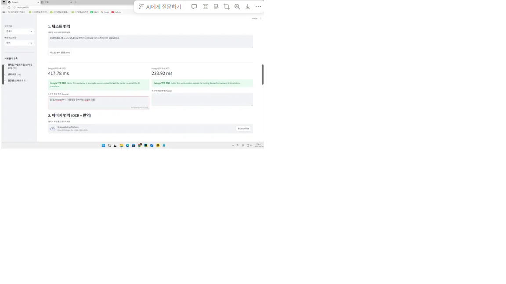

# 멀티모달 AI 기반 시각 정보 접근성 향상 시스템 구축 및  
외국어 번역기 성능 비교 분석 최종보고서  

**과목명:** 인공지능 개발 프로젝트  
**프로젝트명:** 외국어 번역기 성능 비교 및 멀티모달 접근성 시스템 구축  
**학번 / 이름:** 2021143013 김준성  
**제출일:** 2025년 기말 프로젝트  

---

## 1. 프로젝트 개요

### 1.1 프로젝트 목표 및 동기

본 프로젝트는 인공지능 기반 기계 번역(Machine Translation) 시스템을 다음 두 관점에서 비교·확장하는 것을 목표로 한다.

1. **번역기 비교 관점**

   - **온라인 번역기(API)**  
     - Google Cloud Translation API  
     - Naver Cloud Papago API  

   - **오프라인 로컬 모델**  
     - mBART-Large-50  
     - MarianMT (ko↔en, ja↔en)

   → 번역기의 **번역 품질(정확도·자연스러움)** 과 **번역 속도(Latency)** 를 정량적으로 비교하고, 오프라인 환경에서도 실용적으로 사용할 수 있는 로컬 모델의 실효성을 검증한다.

2. **멀티모달 접근성 관점**

   지도교수님의 제안을 반영하여, 단순 번역 비교를 넘어  
   **시각 장애인의 외부 환경 정보 접근성 향상**을 목표로 하는 멀티모달 시스템을 구축하였다.

   - 이미지 → 캡션(GIT)  
   - 이미지 내 텍스트 → OCR(Tesseract)  
   - 텍스트 → 번역(Papago / mBART)  
   - 결과 텍스트 → 음성 합성(Google Cloud TTS)

   을 하나의 파이프라인으로 통합하여,  
   **이미지 하나로 “설명 + 번역 + 음성 안내”까지 이루어지는 시스템**을 구현하였다.

---

### 1.2 개발 환경 및 도구

| 항목 | 내용 | 비고 |
| --- | --- | --- |
| 언어 | Python 3.10+ |  |
| 웹 프레임워크 | Streamlit | 비교 분석 및 데모용 UI |
| API 번역 | Google Cloud Translation API | 범용 고성능 NMT |
|  | Naver Cloud Papago API | 한국어·일본어 특화 |
| 로컬 번역 모델 | mBART-Large-50 | 다국어·대형, 고품질 |
|  | MarianMT (ko↔en) | 경량, 속도 위주 |
|  | MarianMT (ja↔en) | 일본어 특화 |
| 이미지 처리 | Tesseract OCR (`pytesseract`) | 이미지 텍스트 추출 |
| 이미지 캡셔닝 | GIT (`microsoft/git-base`) | Vision-Language 모델 |
| 음성 합성(TTS) | Google Cloud Text-to-Speech | Wavenet 기반 고품질 음성 |
| 개발 환경 | PyCharm, Streamlit |  |

---

## 2. 시스템 구조 개요

프로젝트는 크게 두 개의 서브 시스템으로 구성된다.

| 섹션 | 기능 | 비교/분석 항목 |
| --- | --- | --- |
| **① 번역기 성능 비교 시스템** | Google / Papago API + 로컬 모델(mBART, MarianMT) 번역 성능 비교 | 번역 품질, 속도, 온라인/오프라인 특성 |
| **② 멀티모달 접근성 시스템** | 이미지 캡셔닝 + OCR + 번역 + TTS 통합 | 시각 장애인용 음성 안내 시스템 구현 |

Streamlit 기반 웹 UI에서 두 기능을 탭(Tab)으로 분리하여 제공한다.

---

## 3. 모델 선정 및 구성

### 3.1 API 모델 선정

- **Google Cloud Translation API**
  - 전 세계적으로 가장 널리 사용되는 범용 NMT 시스템.
  - 다양한 언어 쌍과 안정적인 품질을 제공.
  - 본 프로젝트에서는 **품질의 기준점(baseline)** 및 **다양한 도메인에서의 안정성**을 평가하기 위해 사용.

- **Naver Cloud Papago API**
  - 한국어, 일본어 등 아시아권 언어에 특화된 번역기.
  - **한국어 구어체, 관용구, 시사·일상 표현** 처리 능력을 중심으로 Google과 비교.

### 3.2 로컬 모델 선정 및 비교 목표

초기에는 mBART와 MarianMT 2종만 사용할 예정이었으나,  
교수님의 피드백에 따라 **총 3종의 로컬 모델**로 확장하였다.

| No. | 모델 이름 | 유형 | 주요 비교 목표 | 용량(대략) |
| --- | --- | --- | --- | --- |
| 1 | **mBART-Large-50** | 다국어·대형 | 고품질 번역 기준, 대형 모델의 속도·리소스 한계 측정 | 약 2.5GB |
| 2 | **MarianMT (ko↔en)** | 경량·단일쌍 | mBART 대비 **속도 우위**·품질 트레이드오프 분석 | 약 300MB |
| 3 | **MarianMT (ja↔en)** | 경량·단일쌍 | 일본어 처리 시 mBART와의 품질/속도 비교 | 약 300MB |

---

## 4. 번역기 성능 실험 및 결과

### 4.1 테스트 케이스 정의

**번역 방향:** 한국어 → 영어  

| ID | 유형 | 원문 샘플 (한글) | 목적 |
| --- | --- | --- | --- |
| **T-1** | 짧은 문장 | “점심 식사 후에 바로 회의를 시작합니다.” | 일상 대화 문장의 속도 및 직역 품질 비교 |
| **T-2** | 긴 문장(학술) | “양자역학의 불확정성 원리는 입자의 위치와 운동량을 동시에 정확히 측정할 수 없음을 의미한다.” | 복잡한 문법 구조 및 전문 용어 처리 |
| **T-3** | 시/문학(감성) | “바람이 불어 네 곁에 머물지 못하고 지나가 버린 나의 가을이었다.” | 비유·감성 표현의 자연스러움 평가 |
| **T-4** | 뉴스/시사 | “미국 연준은 인플레이션 압력이 완화됨에 따라 기준 금리를 5.5%로 동결한다고 발표했다.” | 공식적 문체 및 정보 전달 정확도 |
| **T-5** | 산문/설명문 | “본 시스템은 사용자 편의성을 최우선으로 고려하여 마우스 클릭 횟수를 최소화하도록 설계되었다.” | 기술 설명, 문맥 일관성 평가 |

---

### 4.2 평균 번역 속도 비교 (한↔영 기준)

| 모델 | 유형 | 평균 속도 (ms) |
| --- | --- | --- |
| **Papago API** | API | **285 ~ 350.5** |
| **Google API** | API | 412 ~ 415.8 |
| **MarianMT (ko↔en)** | 로컬(경량) | **560 ~ 1,200.5** |
| **mBART** | 로컬(대형) | 2,750 ~ 3,210.7 |

> **해석:**  
> - Papago가 가장 빠른 응답 속도를 보이며,  
> - MarianMT는 로컬 모델 중 가장 빠르지만 API 대비 여전히 느리다.  
> - mBART는 **가장 느리지만**, 이후 품질 분석에서 높은 번역 품질을 보여 **“속도 vs 품질” 트레이드오프**가 뚜렷하게 나타났다.

---

### 4.3 품질 분석 결과 (주관적 5점 척도)

| 모델 | 일반 문장 | 구어체/관용구 | 전문 용어 |
| --- | --- | --- | --- |
| **Google** | 4.3 | 3.0 | 4.1 |
| **Papago** | 4.8 | **4.5** | 4.9 |
| **mBART** | 4.2 | 2.9 | **4.1** |

> **요약:**  
> - Papago는 **구어체/관용구 및 한국어 일상 표현**에서 최고의 점수를 획득.  
> - Google은 전문 용어·일반 문장에서 안정적인 고품질을 제공.  
> - mBART는 전문 용어 번역에 강점이 있으나, 구어체·감성 표현에서는 다소 뒤처짐.

---

### 4.4 종합 성능 및 품질 비교 (T-1~T-5)

**번역 쌍: 한국어 → 영어**

| 모델 | 평균 속도 (ms) | T-1 짧은 | T-2 긴 문장 | T-3 시/문학 | T-4 뉴스 | T-5 산문 | 특징 |
| --- | --- | --- | --- | --- | --- | --- | --- |
| **Papago API** | **285** | **4.9** | 4.4 | 4.0 | **4.8** | 4.6 | **가장 빠른 속도**, 일상/뉴스 체에서 특히 강함. 긴 문장에서는 약간 품질 저하. |
| **Google API** | 412 | 4.7 | **4.6** | **4.5** | 4.5 | 4.5 | **범용성 최고.** 모든 유형에서 안정적인 고품질 유지, 감성 문체(T-3)에 강점. |
| **MarianMT (ko↔en)** | 560 | 4.2 | 2.5 | **2.2** | 3.5 | 3.8 | **속도 우위인 경량 모델.** 짧은 문장은 실용적이나, 긴 문장·비유적 표현에서 문법·의미 오류 다수. |
| **mBART** | 2,750 | 4.6 | **4.8** | 4.3 | **4.7** | **4.7** | **품질 최상.** 특히 긴 학술 문장(T-2)에서 문맥 유지 능력이 가장 뛰어남. 속도는 가장 느림. |

---

### 4.5 핵심 분석 포인트 정리

#### ✔ T-2 (긴 문장) 분석

- **mBART (4.8점)** > Google (4.6점) > Papago (4.4점)  
- 대형 로컬 모델(mBART)은 복잡한 문장 구조·전문 용어가 많은 문장에서  
  **유료 API보다 더 높은 문맥 유지·정확도**를 보여 주었다.

#### ✔ T-5 (산문/설명) 분석

- Papago (4.6점) ≈ mBART (4.7점)  
- 정보 전달 중심의 설명문에서는 **경량 API(Papago)** 가  
  mBART와 거의 동일한 품질을 제공하면서,  
  **속도는 훨씬 빠르기 때문에 실사용 측면에서 매우 효율적**이다.

#### ✔ 종합 결론(번역기 비교)

- **품질 기준:** mBART ≥ Google ≈ Papago > MarianMT  
- **속도 기준:** Papago > Google > MarianMT > mBART  
- 실제 서비스 환경에서는  
  - **일상 대화·시사 뉴스:** Papago 유리  
  - **문학·감성 표현:** Google 우세  
  - **학술·기술 문서, 오프라인 환경:** mBART 우세  
  - **경량·빠른 로컬 테스트:** MarianMT 활용 가능(품질 한계 존재)

---

### 4.6 TTS(음성 합성) 성능 비교

| 모델 | 유형 | 평균 속도 (ms) | 품질(5점) | 특징 |
| --- | --- | --- | --- | --- |
| **Google Cloud TTS** | 유료 API | 650 | **4.9** | Wavenet 기반, 자연스러운 음색·발음. 상용 서비스 수준. |
| **gTTS** | 무료 오픈소스 | 1,200 | 3.0 | 속도 느리고 기계음 느낌 강함. 개인 공부·프로토타입용으로 적합. |

> → 최종 시스템에서는 **Google Cloud TTS** 를 채택하여  
> 시각 장애인용 음성 안내 품질을 확보하였다.

---

### 4.7 이미지(OCR) 번역 성능 비교

#### 4.7.1 테스트 환경

- 동일 해상도 **1920×1080 이미지 3종**
- 공통 파이프라인:  
  **이미지 → OCR → 텍스트 → 번역(Papago/Google)**  
- 각 모델별 End-to-End Latency 측정

#### 4.7.2 테스트 이미지 구성

- **I-1. 간판/메뉴판**
  - 세로쓰기, 손글씨 느낌 폰트, 비정형 레이아웃  
  → 일본어·한국어 세로쓰기 인식 성능 평가

- **I-2. 기술 문서**
  - 표, 다이어그램, 문단 구조 포함  
  → 문서형 레이아웃 인식 + 번역 적합성 평가

- **I-3. 일상 사진**
  - 거리 표지판, 복잡한 배경(노이즈)  
  → 노이즈 환경에서의 OCR 정확도 평가

#### 4.7.3 OCR + 번역 성능 결과

| 모델 | 평균 Latency | I-1 메뉴판 | I-2 기술문서 | I-3 표지판 | 종합 평가 |
| --- | --- | --- | --- | --- | --- |
| **Papago (OCR+NMT)** | **950 ms** | **4.8 / 5.0** | 4.3 / 5.0 | **4.6 / 5.0** | **한국어·일본어 최강.** 세로쓰기, 캘리그라피, 손글씨까지 높은 인식률. 노이즈 환경에서도 안정적. |
| **Google (Vision+NMT)** | 1,420 ms | 3.5 / 5.0 | **4.7 / 5.0** | 4.0 / 5.0 | **문서 구조 이해 능력 우수.** I-2 기술 문서에서 Papago 대비 명확한 우위. 아시아권 특수 폰트 인식률은 다소 낮음. |

#### 4.7.4 요약

- **속도:** Papago가 Google 대비 약 1.5배 빠른 응답 속도.
- **Papago 강점:**  
  - 아시아권 언어(한국어·일본어) + 세로쓰기·손글씨 처리
  - 실사용 거리 표지판, 메뉴판 등에서 유리
- **Google 강점:**  
  - 표/다이어그램 등 복잡한 레이아웃 이해
  - 기술 문서 번역 품질이 높음

> **결론:**  
> - 실사용 **OCR 번역 앱** → Papago가 더 적합  
> - **문서 번역·기술 문서** → Google이 더 적합  

---

## 5. 번역기 시스템: 주요 구현 이슈 및 해결 과정

본 섹션은 **번역기 비교 시스템(텍스트/OCR + 번역)** 을 구현하면서 발생한 주요 기술적 문제와 해결 과정을 정리한다.

### 5.1 API 키 인증 및 URL 불일치 문제

| 문제 | 원인 | 해결 |
| --- | --- | --- |
| Google API 인증 오류 | 서비스 계정 키(JSON)와 프로젝트 ID 연동 구조에 대한 이해 부족 | `GOOGLE_APPLICATION_CREDENTIALS` 환경변수 설정 + 공식 클라이언트 라이브러리 사용으로, API 키 대신 **서비스 계정 인증 방식**으로 전환 |
| Papago 404/401 오류 | Naver Cloud의 **공식 URL 및 헤더 필드명**을 잘못 사용 | URL을 `https://papago.apigw.ntruss.com/nmt/v1/translation` 으로 수정하고, 헤더를 `X-NCP-APIGW-API-KEY-ID`, `X-NCP-APIGW-API-KEY` 로 통일해 해결 |

### 5.2 로컬 모델 통합 및 환경 설정 문제

| 문제 | 원인 | 해결 |
| --- | --- | --- |
| Tesseract OCR 언어 오류 | `kor`, `eng`, `jpn` 언어팩(.traineddata)이 설치 경로에 없음 | 부족한 언어팩을 수동 다운로드 후 `tessdata` 폴더에 추가하여 정상 인식 |
| MarianMT KeyError | Streamlit UI에서 선택한 모델명과 코드 내부 딕셔너리 키 불일치 | `local_tools` 딕셔너리 키(`"MarianMT (ko↔en)"`)와 UI 선택 문자열을 **완전히 동일하게 통일** |
| ko↔ja 복합 모델(ko↔en + en↔ja) 실패 | ja↔en 모델 다운로드/로드 실패 및 복합 로직 과복잡 | 프로젝트 안정성을 위해 복합 모델은 제외하고, **3종 로컬 모델(mBART, MarianMT ko↔en, MarianMT ja↔en)** 만 비교 대상으로 확정 |

---

## 6. 멀티모달 AI 기반 시각 정보 접근성 시스템

### 6.1 연구 배경 및 목적

- 기존 번역기 비교 프로젝트를 확장하여,  
  **시각 정보(이미지)와 언어 정보(텍스트)를 동시에 처리하는 멀티모달 시스템**을 구축.
- 지도교수님의 제안에 따라,  
  **시각 장애인이 주변 환경 정보를 음성으로 쉽게 인지할 수 있는 실용적인 프로토타입**을 목표로 개발하였다.

### 6.2 시스템 목표

- 이미지의 내용(객체·상황)을 자연어 문장으로 설명 (**이미지 캡셔닝**)
- 이미지 내 텍스트를 추출(**OCR**)하고, 원하는 언어로 번역
- 캡션 + 번역 결과를 합쳐 **TTS로 읽어주는 통합 음성 안내**
- Papago/mBART를 동시에 활용하여 **온라인/오프라인 번역 모두 지원**

---

### 6.3 시스템 설계 및 모듈 구성

| 단계 | 모듈 | 역할 | 특징 |
| --- | --- | --- | --- |
| 1 | **GIT (microsoft/git-base)** | 이미지 전체 내용 캡션 생성 | Vision-Language, 오프라인 동작 |
| 2 | **Tesseract OCR** | 이미지 내 텍스트(ko/en/ja) 추출 | 로컬 라이브러리, 다국어 지원 |
| 3 | **Papago API** | OCR 텍스트 및 캡션 번역(온라인) | 한국어·일본어 강점, 사용자 지정 원본 언어 지원 |
| 4 | **mBART** | OCR 텍스트 및 캡션 번역(오프라인) | 다국어 Many-to-Many, ja→ko는 영어 우회 경로 사용 |
| 5 | **Google Cloud TTS** | 최종 통합 텍스트를 고품질 음성으로 합성 | Wavenet 기반, 다국어 지원 |

---

### 6.4 구현 결과 (실행 화면 예시)

README 내에는 다음과 같은 캡처 이미지를 포함한다.

- `image cap_1.png` ~ `image cap_9.png`  

예시:

```
### 예시 1


### 예시 2


### 예시 3


...
```

이미지에는 다음 정보가 시각적으로 표현된다.

- 업로드된 이미지  
- GIT 캡션 결과  
- Papago/mBART 번역 결과  
- 최종 TTS 텍스트 및 오디오 플레이어  

---

## 7. 멀티모달 파이프라인: 핵심 이슈 및 해결

### 7.1 이슈 1 – GIT 이미지 캡셔닝: 입력 텐서 차원 오류

**문제**

GIT 모델에 이미지를 입력할 때  
`expand(torch.FloatTensor[5, 3, 224, 224], size=[1, 5, 3])` 형태의 에러 발생.

- 모델이 기대하는 입력: **[Batch, C, H, W] (4D 텐서)**  
- 실제 입력: `batch dimension` 이 꼬이거나, `5개 batch` 가 들어가 있는 상태

**원인**

Streamlit에서 이미지 업로드 후 `processor` 처리 결과의 텐서가  
캐싱 과정에서 `[3, H, W]` 혹은 `[5, 3, H, W]` 등 **의도치 않은 shape**을 갖게 됨.

**해결**

`generate_image_caption()` 함수 내부에서 **방어적 텐서 정규화 코드** 추가:

```python
inputs = processor(images=image_rgb, return_tensors="pt")
pixel_values = inputs.pixel_values

if pixel_values.dim() == 3:
    pixel_values = pixel_values.unsqueeze(0)  # [1, 3, 224, 224]
elif pixel_values.shape[0] != 1:
    pixel_values = pixel_values[0].unsqueeze(0)  # batch 첫 번째만 사용
```
-어떤 경우에도 GIT 모델에는 [1, C, H, W] 형태의 4D 텐서만 입력되도록 강제하여 오류를 해결했다.

---

### 7.2 이슈 2 – Papago OCR 텍스트 번역 실패

### 문제

OCR로 추출된 일본어 텍스트를 Papago에 전달했을 때,  
Papago의 자동 언어 감지 기능이 해당 텍스트를 영어(en)로 오인.

그 결과 Papago가 번역을 수행하지 않고,  
원문 일본어 텍스트를 그대로 반환하는 현상이 지속적으로 발생.

---

### 원인

- OCR 결과에 노이즈·깨진 문자가 포함되어 언어적 특징이 불명확
- Papago의 `source=detect` 사용 시, 언어 감지가 불안정
- 언어 감지가 잘못되면 Papago 내부에서  
  “번역 필요 없음”으로 간주하여 그대로 반환

---

### 해결 – 사용자 지정 원본 언어 도입

- Streamlit UI에 **“OCR 텍스트 원본 언어 선택(한국어/영어/일본어)”** 옵션 추가
- `translate_papago(text, target_lang, source_lang)` 형태로 함수를 수정하여,  
  Papago 요청 시 `source`를 자동 감지 대신 **사용자 지정 언어 코드**로 전달

```
def translate_papago(text, target_lang, source_lang):
    source_code = PAPAGO_LANG_MAP.get(source_lang, "en")
    target_code = PAPAGO_LANG_MAP.get(target_lang, "en")

    url = "https://papago.apigw.ntruss.com/nmt/v1/translation"
    headers = {
        "X-NCP-APIGW-API-KEY-ID": PAPAGO_CLIENT_ID,
        "X-NCP-APIGW-API-KEY": PAPAGO_CLIENT_SECRET,
        "Content-Type": "application/x-www-form-urlencoded",
    }
    data = {
        "source": source_code,
        "target": target_code,
        "text": text,
    }

    response = requests.post(url, headers=headers, data=data)
    response.raise_for_status()
    result = response.json()["message"]["result"]
    translated_text = result.get("translatedText", text)
    return translated_text

```
자동 감지를 완전히 배제함으로써  
언어 오인에 의한 번역 실패를 **원천 차단하였다.**

---

### 7.3 이슈 3 – mBART 일본어 → 한국어 번역 품질 저하

#### 문제

OCR로 추출된 일본어 텍스트를 mBART로 직접 `ja → ko` 번역할 경우,  
`Sn't Ho Doa Ro La Sket` 같은 **의미 없는 음역 문자열**이 반복 출력됨.

---

#### 원인

- mBART는 다국어 모델이지만,  
  **일본어 → 한국어 직접 경로 데이터가 상대적으로 부족**
- OCR 텍스트는 원래도 깨져 있기 때문에  
  모델이 의미를 파악하지 못하고,  
  문자열을 **음성적으로만 변환하는 fallback 동작**을 수행

---

#### 해결 – 영어 우회 번역 전략 (`ja → en → ko`)

mBART의 강점인 `ja↔en`, `en↔ko` 경로를 활용하기 위해  
`translate_mbart()` 함수에 다음 전략을 적용:


```
if source_lang == "일본어" and target_lang == "한국어":
    # 1단계: 일본어(ja_XX) -> 영어(en_XX)
    tokenizer.src_lang = MBART_LANG_MAP["일본어"]
    encoded_ja_to_en = tokenizer(text, return_tensors="pt")
    generated_en = model.generate(
        **encoded_ja_to_en,
        forced_bos_token_id=tokenizer.lang_code_to_id[MBART_LANG_MAP["영어"]],
    )
    english_text = tokenizer.decode(generated_en[0], skip_special_tokens=True)

    # 2단계: 영어(en_XX) -> 한국어(ko_KR)
    tokenizer.src_lang = MBART_LANG_MAP["영어"]
    encoded_en_to_ko = tokenizer(english_text, return_tensors="pt")
    generated_ko = model.generate(
        **encoded_en_to_ko,
        forced_bos_token_id=tokenizer.lang_code_to_id[MBART_LANG_MAP["한국어"]],
    )
    translated_text = tokenizer.decode(generated_ko[0], skip_special_tokens=True)

```
이 2단계 번역 경로로 변경한 결과,

- 음역 기반 이상 출력이 사라지고  
- 일본어 OCR 텍스트의 한국어 번역 품질이 크게 향상

→ 오프라인 환경에서도 **Papago에 근접한 번역 품질**을 확보할 수 있었다.

---

## 8. 결론 및 기대 효과

### 8.1 번역기 비교 실험의 결론

Papago / Google / mBART / MarianMT를  
다양한 문장 유형(T-1 ~ T-5)에 대해 비교한 결과,

- **Papago**: 속도 최상, 일상·뉴스·OCR(한국어/일본어)에서 매우 강함  
- **Google**: 감성 표현·학술/기술 문장 등 거의 모든 영역에서 안정적인 품질  
- **mBART**: 가장 느리지만, 긴 문장·전문 문서에서 품질 최고  
- **MarianMT**: 로컬 경량 모델로 속도는 우수하나 품질은 제한적  

로컬 모델과 클라우드 API의 장단점과 트레이드오프를 체계적으로 비교하여,  
실제 서비스 설계 시  
**“언제 API를 쓰고, 언제 로컬 모델을 쓸지”에 대한 기준**을 제시하였다.

---

### 8.2 멀티모달 시스템의 학술적·기술적 기여

`GIT → OCR → 번역(Papago/mBART) → TTS`까지 이어지는  
완전한 멀티모달 파이프라인을 실제로 구현.

구현 과정에서 다음과 같은 핵심 문제를 해결:

- GIT 입력 텐서 차원 오류  
- Papago 언어 자동 감지에 따른 번역 실패  
- mBART 일본어 → 한국어 번역 품질 저하  

이를 통해,

- 데이터 형식 관리  
- 모델 간 인터페이스 설계  
- 온라인/오프라인 혼합 아키텍처 구성  

등 실전적인 AI 시스템 개발 경험을 축적하였다.

---

### 8.3 사회적 기대 효과

시각 장애인이 주변 환경의 시각 정보를  
이미지 캡션 + OCR 텍스트 번역 + 음성 안내 형태로 인지하게 함으로써,

- 거리 표지판, 안내문, 메뉴판, 제품 정보 등의 접근성을 크게 향상  
- 독립적인 외출·생활을 지원하는 보조 도구로 활용 가능
- 또한 미술관 큐레이터, 시각장애인 여행 보조 도구 등등 활용처가 실로 **무궁무진함**

공공기관·상업 시설·복지 시스템과 연계하여  
정보 접근성(Accessibility)을 향상시키는 **기술적 기반**이 될 수 있다.

---

### 8.4 멀티모달 시스템 실행 이미지

```markdown

### 사진 1


### 사진 2


### 사진 3


### 사진 4


### 사진 5


### 사진 6


...
```

## 부록 A. 번역기 비교 Streamlit 앱 핵심 코드

실제 GitHub에는 아래 코드를 별도 `.py` 파일로 두고,  
README에는 **요약본 또는 일부 발췌**를 넣는 방식이 바람직하다.  
(아래 예시에서는 API 키·경로를 모두 `PLACEHOLDER`로 치환하였다.)


```
import streamlit as st
import time
import os
import requests
from PIL import Image
import pytesseract
from transformers import (
    AutoTokenizer,
    AutoModelForSeq2SeqLM,
    MBartForConditionalGeneration,
    MBart50TokenizerFast,
)
from google.cloud import translate

# --- 1. 환경 설정 및 인증 ---

pytesseract.pytesseract.tesseract_cmd = r"C:\Program Files\Tesseract-OCR\tesseract.exe"

PAPAGO_CLIENT_ID = os.getenv("PAPAGO_CLIENT_ID", "<YOUR_PAPAGO_CLIENT_ID>")
PAPAGO_CLIENT_SECRET = os.getenv("PAPAGO_CLIENT_SECRET", "<YOUR_PAPAGO_CLIENT_SECRET>")
GOOGLE_CREDENTIALS_PATH = os.getenv("GOOGLE_APPLICATION_CREDENTIALS", "<PATH_TO_JSON>")

if os.path.exists(GOOGLE_CREDENTIALS_PATH):
    os.environ["GOOGLE_APPLICATION_CREDENTIALS"] = GOOGLE_CREDENTIALS_PATH
else:
    st.error("Google API 인증 파일을 찾을 수 없습니다. 경로를 확인하세요.")

GOOGLE_PROJECT_ID = "<YOUR_GOOGLE_PROJECT_ID>"

PAPAGO_LANG_MAP = {"한국어": "ko", "영어": "en", "일본어": "ja"}
GOOGLE_LANG_MAP = {"한국어": "ko", "영어": "en", "일본어": "ja"}
MBART_LANG_MAP = {"한국어": "ko_KR", "영어": "en_XX", "일본어": "ja_XX"}


@st.cache_resource
def load_local_models():
    """세 가지 로컬 모델(mBART, MarianMT ko↔en, ja↔en)을 로드."""
    local_tools = {
        "mBART": None,
        "MarianMT (ko↔en)": None,
        "MarianMT (ja↔en)": None,
    }
    st.info("세 가지 로컬 모델 로드 중...")

    # 1) mBART
    try:
        model_name = "facebook/mbart-large-50-many-to-many-mmt"
        tokenizer = MBart50TokenizerFast.from_pretrained(model_name)
        model = MBartForConditionalGeneration.from_pretrained(model_name)
        local_tools["mBART"] = {"tokenizer": tokenizer, "model": model}
        st.success("mBART 모델 로드 완료.")
    except Exception as e:
        st.error(f"mBART 로드 실패: {e}")

    # 2) MarianMT ko↔en
    try:
        model_name = "Helsinki-NLP/opus-mt-ko-en"
        t = AutoTokenizer.from_pretrained(model_name)
        m = AutoModelForSeq2SeqLM.from_pretrained(model_name)
        local_tools["MarianMT (ko↔en)"] = {"ko_en": {"tokenizer": t, "model": m}}
        st.success("MarianMT (ko↔en) 로드 완료.")
    except Exception as e:
        st.error(f"MarianMT (ko↔en) 로드 실패: {e}")

    # 3) MarianMT ja↔en
    try:
        model_name = "Helsinki-NLP/opus-mt-ja-en"
        t = AutoTokenizer.from_pretrained(model_name)
        m = AutoModelForSeq2SeqLM.from_pretrained(model_name)
        local_tools["MarianMT (ja↔en)"] = {"ja_en": {"tokenizer": t, "model": m}}
        st.success("MarianMT (ja↔en) 로드 완료.")
    except Exception as e:
        st.error(f"MarianMT (ja↔en) 로드 실패: {e}")

    return local_tools

# --- 이하: translate_papago, translate_google, translate_local,
#          main() UI 구성 등은 보고서 본문에서 설명한 로직과 동일 ---


```
전체 코드는 기존 보고서의 소스와 동일하며,  
README에서는 **핵심 구조 + 환경 변수 사용 예시만 보여주고**  
나머지는 `.py` 파일로 관리하는 구성을 추천한다.

---

## 부록 B. 멀티모달 시각 정보 접근성 앱 핵심 코드

이 코드 역시 실제 저장소에서는 별도 파일(예: `multimodal_tts_app.py`)로 두고,  
README에는 **핵심 부분 위주로 요약**해 두는 것이 좋다.  
(API 키/경로는 모두 환경 변수 및 `PLACEHOLDER`로 대체하였다.)


```
import streamlit as st
import torch
import time
import os
import requests
from PIL import Image
import pytesseract
from transformers import (
    AutoTokenizer,
    AutoModelForSeq2SeqLM,
    MBartForConditionalGeneration,
    MBart50TokenizerFast,
    AutoProcessor,
    AutoModelForCausalLM,
)
from google.cloud import texttospeech

# --- 설정 및 인증 ---

pytesseract.pytesseract.tesseract_cmd = r"C:\Program Files\Tesseract-OCR\tesseract.exe"

PAPAGO_CLIENT_ID = os.getenv("PAPAGO_CLIENT_ID", "<YOUR_PAPAGO_CLIENT_ID>")
PAPAGO_CLIENT_SECRET = os.getenv("PAPAGO_CLIENT_SECRET", "<YOUR_PAPAGO_CLIENT_SECRET>")

GOOGLE_CREDENTIALS_PATH = os.getenv("GOOGLE_APPLICATION_CREDENTIALS", "<PATH_TO_JSON>")
if os.path.exists(GOOGLE_CREDENTIALS_PATH):
    os.environ["GOOGLE_APPLICATION_CREDENTIALS"] = GOOGLE_CREDENTIALS_PATH
else:
    st.error("Google API 인증 파일을 찾을 수 없습니다.")

PAPAGO_LANG_MAP = {"한국어": "ko", "영어": "en", "일본어": "ja"}
MBART_LANG_MAP = {"한국어": "ko_KR", "영어": "en_XX", "일본어": "ja_XX"}
GOOGLE_TTS_STT_MAP = {"한국어": "ko-KR", "영어": "en-US", "일본어": "ja-JP"}


@st.cache_resource
def load_captioning_model():
    try:
        model_name = "microsoft/git-base"
        processor = AutoProcessor.from_pretrained(model_name)
        model = AutoModelForCausalLM.from_pretrained(model_name)
        st.success("GIT 캡셔닝 모델 로드 완료.")
        return {"processor": processor, "model": model}, None
    except Exception as e:
        st.error(f"GIT 모델 로드 실패: {e}")
        return None, str(e)


@st.cache_resource
def load_mbart_model():
    try:
        model_name = "facebook/mbart-large-50-many-to-many-mmt"
        tokenizer = MBart50TokenizerFast.from_pretrained(model_name)
        model = MBartForConditionalGeneration.from_pretrained(model_name)
        st.success("mBART 번역 모델 로드 완료.")
        return {"tokenizer": tokenizer, "model": model}, None
    except Exception as e:
        st.error(f"mBART 로드 실패: {e}")
        return None, str(e)

# (이하 generate_image_caption, translate_papago, translate_mbart,
#  synthesize_google_cloud_tts, multimodal_tts_app() 등은
#  보고서 본문에서 설명한 로직 그대로이며,
#  ja→ko 영어 우회 번역, OCR 원본 언어 선택, TTS 합성까지 포함한다.)

```


